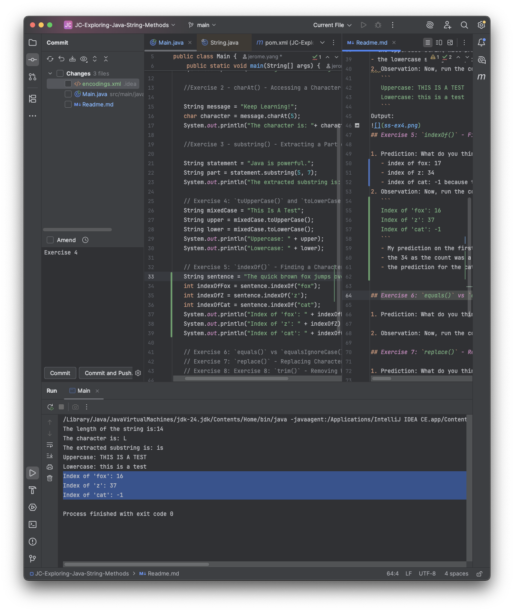
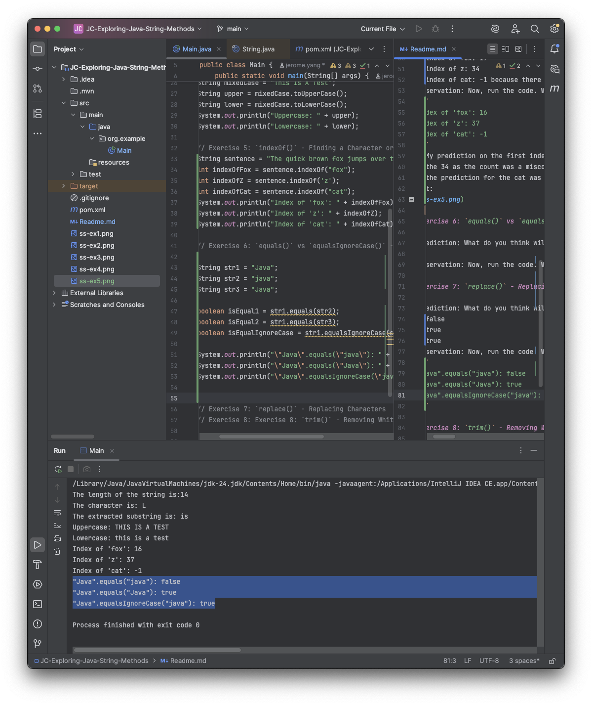
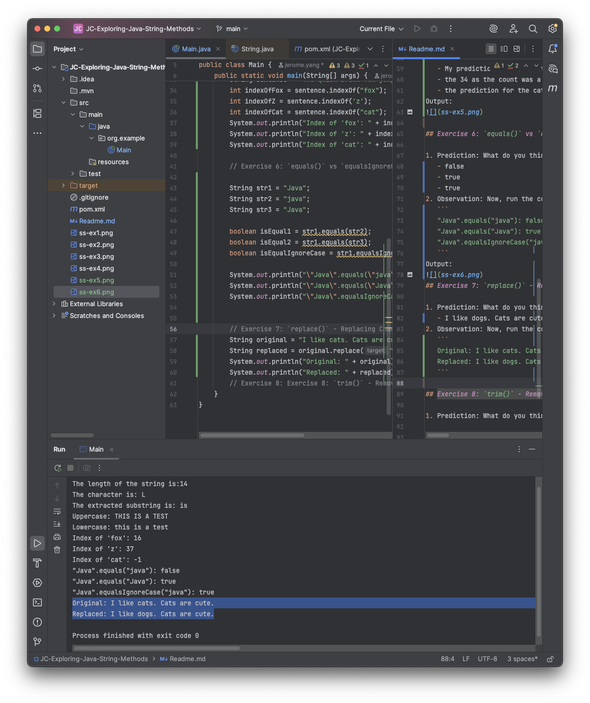
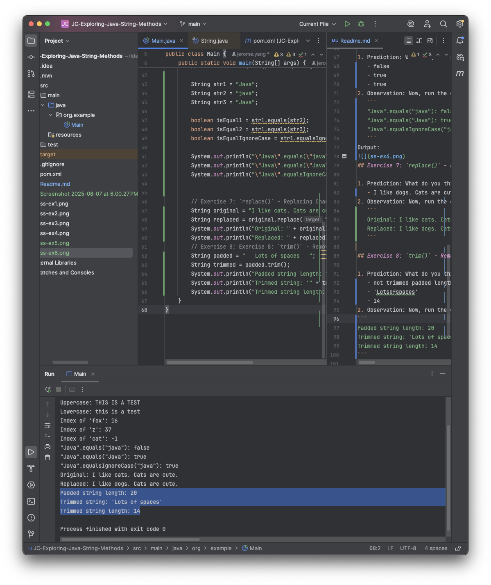

# Exploring Java `String`  Methods

## Exercise 1: `length()` - Finding the String's Size

1. Prediction: What do you think will be the output?
   -  The output will be: 14

2. Observation: Now, run the code. What is the actual output?
   - The class String stores an array of chars, then its method .length() to return an int on how many char are inside the immutable object
   - the counting includes every character may it be letters, or spaces and counts as 1
   - the actual output is 14
   - `The length of the string is:14`
Output:

   
## Exercise 2: `charAt()` - Accessing a Character

1. Prediction: What do you think will be the output?
   - it will be "L", as the At() is a zero-based index

2. Observation: Now, run the code. What is the actual output?
   -  `The character is: L`
Output:

## Exercise 3: `substring()` - Extracting a Part of a String

1. Prediction: What do you think will be the output? 
   - it will be "is ", the substring gets the first parameter int given up until the last of character within the range
   - 

2. Observation: Now, run the code. What is the actual output?
   - `The extracted substring is: is`
   

## Exercise 4: `tuUpperCase()` and `toLowerCase()` - Changing Case

1. Prediction: What do you think will be the output?
- the uppercase string will print "THIS IS A TEST"
- the lowercase string will print the "this is a test"
2. Observation: Now, run the code. What is the actual output?
   ```
   Uppercase: THIS IS A TEST
   Lowercase: this is a test
   ```
Output:

## Exercise 5: `indexOf()` - Finding a Character or a Substring

1. Prediction: What do you think will be the output?
   - index of fox: 17
   - index of z: 34
   - index of cat: -1 because there is no cat
2. Observation: Now, run the code. What is the actual output?
   ```
   Index of 'fox': 16
   Index of 'z': 37
   Index of 'cat': -1
   ```
   - My prediction on the first index was incorrect as I counted with 1 as the start not with zero-based index counting
   - the 34 as the count was a miscount on where the start of the 'z' on lazy is 
   - the prediction for the cat was correct, because no occurence of cat is on the string
Output:

   
## Exercise 6: `equals()` vs `equalsIgnoreCase()` - Comparing Strings

1. Prediction: What do you think will be the output?
   - false
   - true
   - true
2. Observation: Now, run the code. What is the actual output?
   ```
   "Java".equals("java"): false
   "Java".equals("Java"): true
   "Java".equalsIgnoreCase("java"): true
   ```
Output: 

## Exercise 7: `replace()` - Replacing Characters

1. Prediction: What do you think will be the output?
   - I like dogs. Cats are cute
2. Observation: Now, run the code. What is the actual output?
   ```
   Original: I like cats. Cats are cute.
   Replaced: I like dogs. Cats are cute.
   ```
   
## Exercise 8: `trim()` - Removing Whitespace

1. Prediction: What do you think will be the output?
   - not trimmed padded length: 20
   - 'Lotsofspaces'
   - 14
2. Observation: Now, run the code. What is the actual output?
```
Padded string length: 20
Trimmed string: 'Lots of spaces'
Trimmed string length: 14
```


